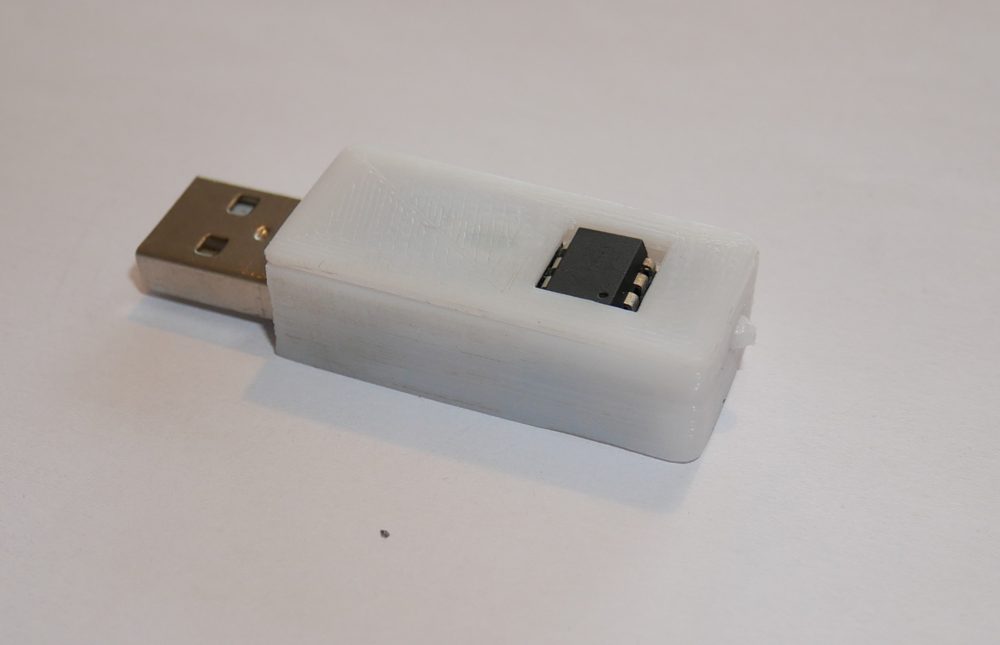
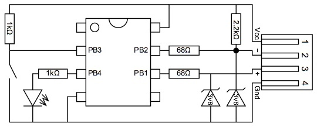

# USBKeychain

## Purpose
USBKeychain is an USB key designed to generate, store, type and delete a password using an inexpensive Atmel Attiny85 chip. It mimics the behavior of an USB keyboard, which makes it (almost) universal and driverless.

## Short user guide
### Button
A short press on the button allow the key to type the stored password.

A long press (5 seconds) on the button resets the stored password.

### Commandline
For more complex operations, the python script command.py must be used while the key is plugged.

## Building the key
Refer to the following drawing to build the key. Then upload the firmware using ISP.

## More
Check the [Wiki](https://github.com/clsergent/USBKeychain/wiki) for more information.

## Credits
This key has been inspired by this project : https://codeandlife.com/2012/03/03/diy-usb-password-generator/

It makes an extensive use of the library V-USB distributed here (under GNU GPL2 or GPL3) : http://www.obdev.at/vusb/ 

## License
This repository and its content are licensed under the EUPL-1.2-or-later.

Check https://joinup.ec.europa.eu/collection/eupl/eupl-text-eupl-12
